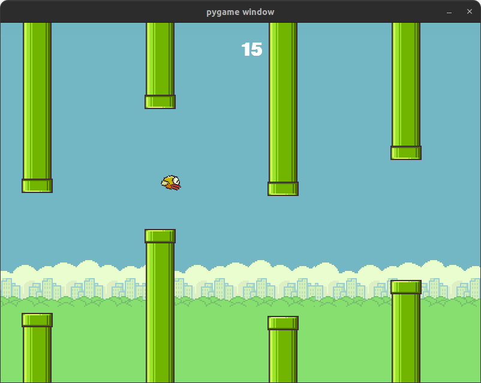

## Реализация игры "Flappy Birds" на `pygame`.

## Установка зависимостей:

1. Создать окружение через `poetry`:
    ```shell
    poetry env use python3.12
    ```

2. Активировать окружение: *(можно и через `poetry shell`, но `shell` в последних версиях является плагином, и не
   предустановлен)*
    ```shell
    eval $(poetry env activate)
    ```

3. Установить только основные зависимости, необходимые для запуска:
   ```shell
   poetry install --no-root --without dev
   ```

4. Установить все зависимости, включая `dev`/`test` (+linter, +pre-commit и т.д.):
    ```shell
    poetry install --no-root
    ```

## Запуск:

1. Играть:
    ```shell
    python run_game.py
    ```    

    - Либо:
    ```shell
    poetry run python run_game.py
    ```

### Предпросмотр:


